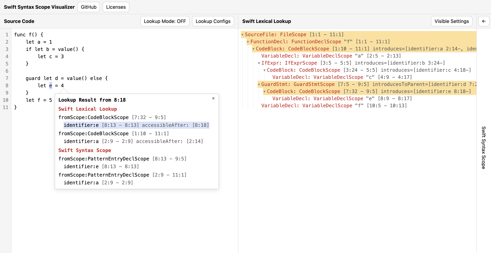

# Swift Syntax Scope Visualizer

[https://kntkymt.github.io/swift-syntax-scope-visualizer/](https://kntkymt.github.io/swift-syntax-scope-visualizer/)

A web app that visualizes scope systems of Swift: [SwiftLexicalLookup](https://github.com/swiftlang/swift-syntax/tree/main/Sources/SwiftLexicalLookup) and [SwiftSyntaxScope](https://github.com/kntkymt/swift-syntax-scope) (a port of the Swift compiler's [ASTScope](https://github.com/swiftlang/swift/blob/main/lib/AST/ASTScope.cpp) to Swift Syntax).

The frontend is written in Swift using Swift for WASM.

Uses [swift-react](https://github.com/omochi/swift-react) as the frontend library.

